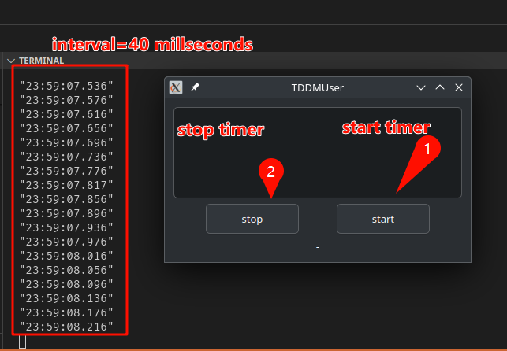

# HighPrecisionTimer
This is a millisecond-level timer implemented with timerfd+epoll on Linux, and the demo is developed using Qt.

## how to use
- I need to create a timer that runs periodically with millisecond precision. The timer supports setting the running period and a callback function for timeout. Additionally, the timer provides interfaces for starting the timer, stopping the timer, and setting the timer interval.
- follow this step
``` c++


HighPrecisionTimer timer;
/// mill second: 40
timer.setInterval(40);

/// ... replace your call back func
timer.setCallback(...);

/// start timer
/// true - the timer timeout function execution is located in a separate thread
/// false - the timer timeout function execution is not in a separate thread.
timer.start(true);

/// do something
...

/// stop timer
timer.stop();

```

## dmeo
- you can get the demo from `TDDMUser` header file and source file.


## example 
- results on `Manjaro` 



# enjoy